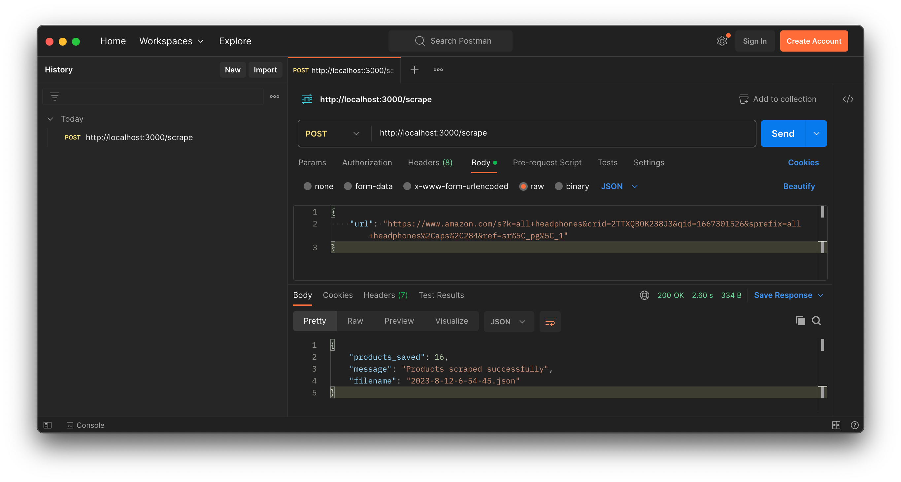

# Web-scrapping with Nodejs and Cheerio

CI pipeline for a web-scrapper build with Nodejs and Cheerio

## Install dependencies

```bash
npm install
```

## Run scraper

```bash
npm start
```

Then head to a HTTP client (like Postman, Insomnia, or Hoppscotch), enter the endpoint "/scrape", enter a request body like the one below (this app is limited to URLs with the base URL as `https://www.amazon.com`) and run the request.

```json
{
  "url": "https://www.amazon.com/s?k=all+headphones&crid=2TTXQBOK238J3&qid=1667301526&sprefix=all+headphones%2Caps%2C284&ref=sr%5C_pg%5C_1"
}
```

Expect a response like the screenshot below depicts and a file in the `data` folder.



## Test the scrapper

Run

```bash
npm test
```

Expect results like these

```bash

> test
> jest --detectOpenHandles

  console.log
    Server is running on port 3000

      at Server.log (src/server.js:15:11)

 PASS  __tests__/scraper.test.js
  scraper
    ✓ generateFilename() returns a string (2 ms)
    ✓ saveProductJson() saves a file (1 ms)
    ✓ POST /scrape returns a 200 status code (2688 ms)

Test Suites: 1 passed, 1 total
Tests:       3 passed, 3 total
Snapshots:   0 total
Time:        2.927 s, estimated 3 s
Ran all test suites.
```
